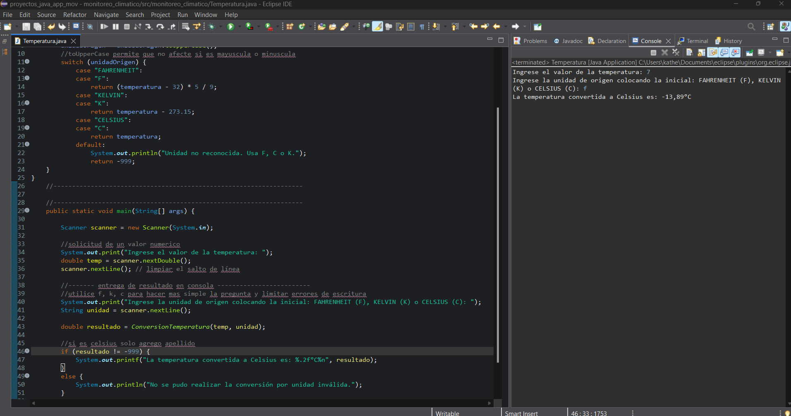
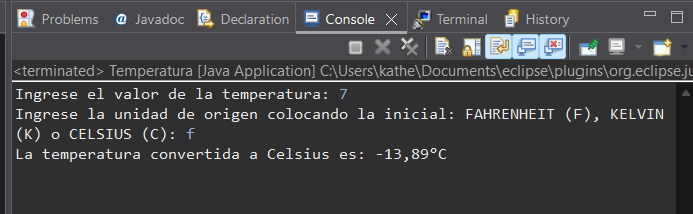
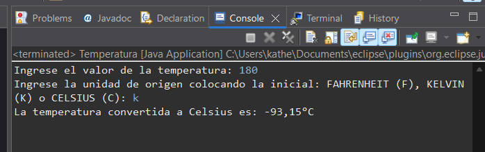
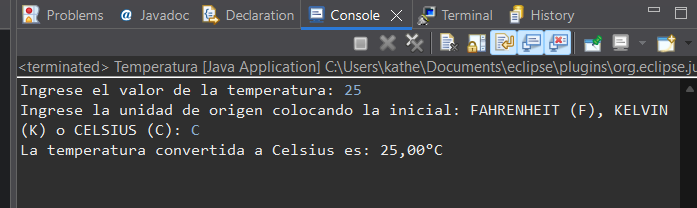

**_<h1 align="center">:vulcan_salute: Monitoreo Climático :computer:</h1>_**

**<h3>:blue_book: Contexto:</h3>**

- temperaturas entre distintas escalas: Celsius, Fahrenheit y Kelvin. Para lograrlo de manera modular y reutilizable, se solicita crear una función que realice esta conversión a Celsius, recibiendo un valor de temperatura y el tipo de unidad de origen.
- Este ejercicio permite reforzar el uso de funciones con parámetros, estructuras condicionales y retorno de valores, aplicando lógica de selección múltiple.

**<h3>:orange_book: Objetivo :</h3>**

- Crear una función que reciba una temperatura y su unidad original, y la convierta a grados Celsius, retornando el valor convertido.
- Luego, usar esta función en un programa principal que solicite datos al usuario, invoque la función y muestre el resultado en pantalla.

**<h3>:green_book: Instrucciones:</h3>**

1. Crear una función llamada ConversionTemperatura(temperatura, unidadOrigen) que reciba:
- temperatura: un valor real. • unidadOrigen: una cadena de texto con uno de los siguientes valores: "FAHRENHEIT", "KELVIN" o "CELSIUS".

2. Según el valor de unidadOrigen, realizar la conversión a grados Celsius utilizando las siguientes fórmulas:
- De Fahrenheit a Celsius: (temperatura - 32) * 5 / 9 
- De Kelvin a Celsius: temperatura - 273.15
- Si ya está en Celsius, retornar el mismo valor.

3. La función debe retornar la temperatura convertida a Celsius.

4. En el programa principal:
- Solicitar al usuario un valor de temperatura y su unidad de origen.
- Llamar a la función ConversionTemperatura con los datos ingresados.
- Mostrar el resultado convertido en pantalla.

**<h3>:book: Ejemplo de Salida:</h3>**

